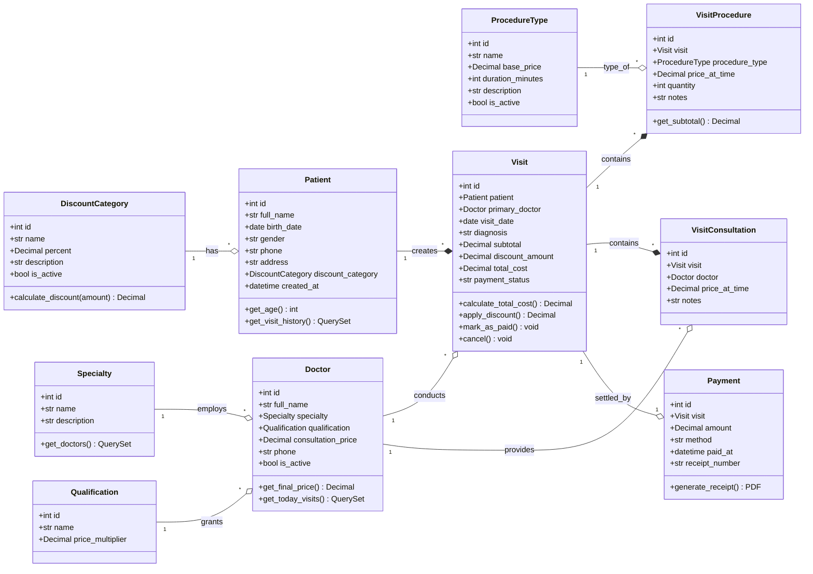
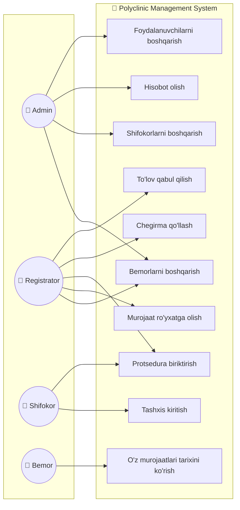

# 🏥 Polyclinic Management System — Class Diagram (UML)

Bu Class Diagram **Django models** bilan to'g'ridan-to'g'ri bog'lanadi. Har bir sinf — bu Django `Model`.



---

## 🎯 Use Case Diagram (qo'shimcha — kim nima qiladi)



---

## 🧠 Asosiy biznes-metodlar (Django'da implementatsiya)

### `Visit.calculate_total_cost()`

```python
def calculate_total_cost(self):
    """Konsultatsiyalar + protseduralar yig'indisi"""
    procedures_sum = self.visitprocedure_set.aggregate(
        total=Sum(F('price_at_time') * F('quantity'))
    )['total'] or 0

    consultations_sum = self.visitconsultation_set.aggregate(
        total=Sum('price_at_time')
    )['total'] or 0

    self.subtotal = procedures_sum + consultations_sum
    return self.subtotal
```

### `Visit.apply_discount()`

```python
def apply_discount(self):
    """Bemor toifasi bo'yicha chegirma qo'llash"""
    if self.patient.discount_category and self.patient.discount_category.is_active:
        percent = self.patient.discount_category.percent
        self.discount_amount = self.subtotal * (percent / 100)
    else:
        self.discount_amount = 0

    self.total_cost = self.subtotal - self.discount_amount
    return self.total_cost
```

### Signal: protsedura qo'shilganda avto-yangilash

```python
@receiver([post_save, post_delete], sender=VisitProcedure)
def update_visit_total(sender, instance, **kwargs):
    visit = instance.visit
    visit.calculate_total_cost()
    visit.apply_discount()
    visit.save()
```
